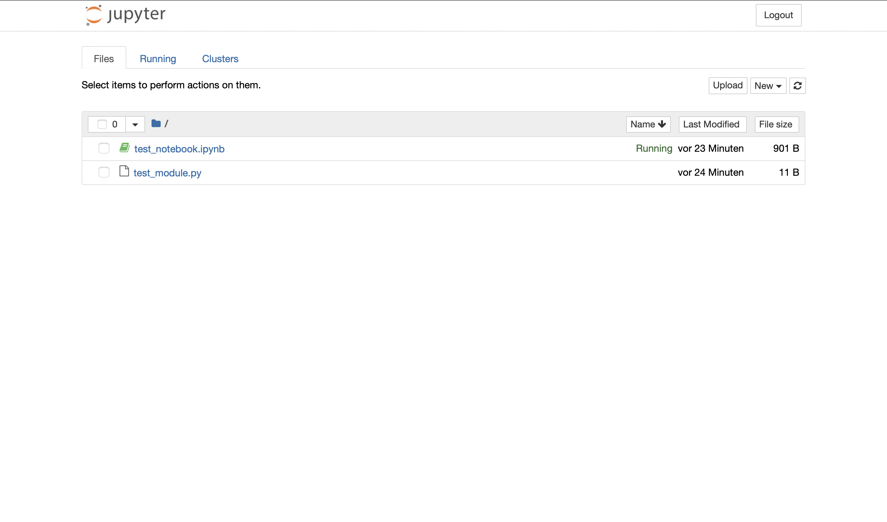

# user-manual

## 1&nbsp; Jupyter Hub

In this chapter, we will briefly describe how to navigate the hub control panel. 

<br />


### 1.1&nbsp; Logging in

> Please make your first **login** as soon as possible, given that you yourself will need to set your password. Neither will you be provided with an initial password, nor will you be able to change an already set password later on - whatever string you type in during your first login will remain your password!

If you have been invited to use our compute servers, you have also been provided with `<user-name>` and `<ip-address>`. Using these credentials, you will be able to log in to the jupyter **hub** (hub control panel). 

To log in to the jupyter hub, ...

1. Enter http://`<ip-adress>` in your browser to access the JupyterHub login page. Note that this page can only be accessed from within the university network or via a virtual private network (VPN).
2. Enter your `<user-name>`. The user name is determined by the admin.
3. Enter an arbitrary password, which is entirely up to you. Only after your first login, your account will have password protection.
4. Click on the `sign in` button, leading you directly to the server options page for your default server.
5. Click on the `home` tab, leading you to the hub control panel.

<br />


### 1.2&nbsp; Starting a Jupyter Server

> Having started a jupyter server, you will be able to use multiple Python (R, Julia, ...) **kernels** to run multiple programs at the same time, please understand that you do *not* need multiple jupyter servers! While we allow that you set up a second jupyter server (named server), please also understand that this will not help you lift resource limits as those are defined on a per-user basis. Use named servers *only* as a means to better organize your code base! 

Having logged in, you will be able to start a jupyter **server** (user instance), either your *default server* or a *named server*. 

To start your **default server**, ...

1. Click on the `home` tab.
2. Click on `start my server`, leading you to the server options page.
3. Select an environment (see chapter 1.3).
4. Click on the `start` button.

To create and start an additional **named server** ...

1. Click on the `home` tab.
2. Enter a name into the field `name your server` and click `add new server`, leading you to the server options page.
3. Select an environment (see chapter 1.3).
4. Click on the `start` button.

<br />


### 1.3&nbsp; Selecting an Environment

> Note that user names with `stud_` prefix will *not* have access to the GPU-enabled image option(s) `[deep_learning]` as well as the larger resource options(s) `[large, extra_large]`. Students that *do* require access to those resources are assigned a user name *without* `stud_` prefix. 

Depending on your user name, the JupyterHub will give you different configuration options to choose from. Remember to choose your environment as small as possible (as large as necessary). 


## 2&nbsp; Jupyter Server

In this chapter, we will briefly describe all of the building blocks that make up your Jupyter Server environment. 

### 2.1&nbsp; User Interface Options

You are provided with two user interface options, Jupyter Lab and Jupyter Notebook. 

<br />


#### 2.1.1&nbsp; Jupyter Lab (default)

The default user interface for the jupyter server is the [Jupyter Lab](https://jupyterlab.readthedocs.io/en/latest/), the url being `http://<ip-adress>/user/<user-name>/lab`. 

The Jupyter Lab user interface gives you all **functionality** that you could possible need in one single browser tab. On the left-hand side, you can find `file browser`, `running kernels`, `table of contents` (for an open notebook), and the `extension manager`. On the right-hand side, you can find `property inspector` and the `debugging tool`. We may use the `kernel` tab to interrupt, shut down, or restart the selected kernel, meaning the kernel that is underlying the notebook or console that you are currently interacting with. We may use the `file` tab to log out, or to go back to the Jupyter Hub (hub control panel) from where we can start and stop all of our Jupyter Server instances. 
With everything located within a single browser tab, note that you can **split your screen** by dragging a tab to either side (up, down, left, right), allowing you to look at multiple files side-by-side. For example, it may make sense for you to run a script on one side and monitor your resource usage on the other. 

The Jupyter Lab user inteface allows for different ways of **running your code**. Both `notebook` and `console` can be used for interactive programming, use the `notebook` runtime if you additionally want to include markdown (see chapter 3.1.1). The `terminal` is less convenient, but it plays an important role when facing long-running jobs (see chapter 3.1.2). 
The Jupyter Lab user interface allows you to open and **display text files** in a variety of formats (.py, .txt, .csv, .json, ...). This can be especially useful if you are trying to display a large .csv file that you would otherwise never be able to fit into memory. 

<br />



#### 2.1.2&nbsp; Jupyter Notebook

The alternative user interface for the jupyter server is the [Jupyter Notebook](https://jupyter-notebook.readthedocs.io/en/latest/), the url being `http://<ip-adress>/user/<user-name>/tree`. You can simply switch to this user interface by replacing `/lab` with `/tree`. Note, however, that this switch will not persist when reloading the page, and that we strongly advise you to use Jupyter Lab.  

The Jupyter Notebook user interface is much more light-weight in its **functionality**. The `Files` tab allows you to browse, upload, create, and delete files (including notebooks). The `Running` tab allows you to monitor and shutdown running notebooks and terminals. 

### 2.2&nbsp; Kernel options

You are provided with one or more kernel options, the default being Python. Please understand that, in terms of maintenance, we will not guarantee other options besides Python. 

#### 2.2.1&nbsp; Python

With all image options, you will have access to a Python 3.x kernel. Therefore, when working on your Jupyter Server, you will mainly use Python. (...)

#### 2.2.2&nbsp; Other

With some image options (`data_science`, ...), you will also have access to other types of kernels such as [R](https://www.r-project.org/about.html) or [Julia](https://julialang.org/). (...)

### 2.3&nbsp; Resource options

> While lots of resources are cool (we think so, too), please understand that you should take only as much as you can *actually* utilize (as much as you will *actually* need) in order to avoid overhead in resource consumption. 

Underlying your Jupyter Server are powerful computing resources that are shared among all user instances. In this regard, learning how to optimize your code is paramount (see chapter 4).

#### 2.3.1&nbsp; CPU

A typical Python program is single-threaded, that is, it uses only *half* of a single central processing unit (CPU) core. Consequently, chances are you may not even require multiple cores. In a data-driven setting, however, a multi-threaded Python program will significantly speed up your workflow.  

#### 2.3.2&nbsp; GPU

A graphics processing unit (GPU) can be used for massively parallelized tasks, including (but not limited to) deep learning. 

#### 2.3.3&nbsp; RAM

On the one hand, CPU and GPU implement high-bandwith yet low-capacity memory, allowing for *extremely* fast data access (TB/s range) at the cost of size (MB range). On the other hand, solid state drive (SSD) and hard disk drive (HDD) represent high-capacity yet low-bandwith memory, allowing for large data storage (terabyte range) at the cost of speed (MB/s range). In the middle of this tiered formation, random access memory (RAM) is the sweet-spot in this trade-off. With regard to runtime, efficient memory utilization is one of the most important, if not *the* most important prerequisite to writing a fast program.  

### 2.4&nbsp; Storage options

You are provided with three storage options. 

#### 2.4.1&nbsp; User storage

Most of the time, you should use your 100 GB of user storage (internal storage). This is **both the fastest and the safest option**, as user storage is based on an NVMe SSD and can be accessed only by you and the admin. 

#### 2.4.2&nbsp; Temp storage

> To keep this drive empty, delete your files on a regular basis. To keep your files safe, always keep a back-up somewhere else. 

(optional) In some cases, you may want to *temporarily* share data with other users. The `temp` storage is relatively fast as it is based on a regular SSD, but please understand that *every* user has read and write permission for this drive and could therefore easily wipe out all of your data. 

#### 2.4.3&nbsp; Read-only storage

> While every user has to sign a non-disclosure agreement (NDA), refer to the [server-data](...) repository to see whether you may use a particular dataset from this drive. 

(optional) Usually, you will want to work with some kind of market data. The `read_only` storage is read-only, meaning that you may always read from this drive, but you do *not* have write permission (do *not* try to delete data). 

#### 2.4.4&nbsp; Databases

TODO: replace the read-only storage with a NoSQL databases. 


## 3&nbsp; Workflow

> Note that any changes made to the environment will not persist after a restart, given that it is rebuilt every time from a docker image. The data in your user storage, however, *will* persist. 

Here, we describe a typical workflow for Python. 

### 3.1&nbsp; Runtime options

Ultimately, you have two relevant runtime options, **notebook** (prototyping) and **terminal** (production). In addition to that, you may also use a **console**, but we generally do not see the need for using one. 

#### 3.1.1&nbsp; Prototyping jobs via notebook

> Please note that the biggest drawback of the notebook is that your program will stop running if you lose internet connection or accidentally close your browser tab! In general, it is possible to reconnect to the kernel that still holds previous results (in memory), but your current results cannot be recovered! 

The notebook (`.ipynb`) is the ideal runtime for prototyping, allowing you to transform and explore your data step-by-step. Each step is represented by a code cell that can be executed as many times and in any order you want. The notebook is interactive in the sense that every variable can be accessed all the time, allowing you to build your program as you go. Of course you could also write all of your code in a single cell, you could import modules (`.py`) that include part of your code, etc. The main idea is that, after running your code, you will be able to simply continue running your code some more (whereas a normal program would simply terminate). 

#### 3.1.2&nbsp; Production jobs via terminal

> Please not that the terminal is the better runtime for long-running production jobs, as it will continue running even when you lose internet connection, accidentally close your browser tab, or simply log out! 

The terminal is less convenient, you simply run a script (`.py`) that will contain and/or import all the functionality that you need, it is **not interactive** by any means. 

**Important:** Whatever you do, we *always* recommend that you log your results in a `.txt` file and regularly save checkpoints so that you are prepared for any kind of system failure (may always happen)! We recommend using our [library](../library) that includes this type of functionality. 

### 3.2&nbsp; Organization options

Having decided on your preferred runtime, you need to decide on how to organize your code base. While most users will simply stick to scripting, we encourage you to consider following a more organized approach based on modules.  

#### 3.2.1&nbsp; Scripting


#### 3.2.2&nbsp; Modules


### 3.3&nbsp; Important steps

When you start writing code, you would typically start with the following steps.  

#### 3.3.1&nbsp; **Request resources** <--- lieber separaten Punkt draus machen

**Important:** If you have access to a GPU and want to use it, you must *always* make a request at the top of your program, checking if your requested resources are available and to prevent your program from potentially crashing another user's job that may already have been running for days (they will not be happy)! 

#### 3.3.2&nbsp; Import modules

Next, you will want to import other modules. (...)

#### 3.3.3&nbsp; Load input data

Your first *actual* processing step will typically be to load data. 

Most of the time, you will use the Python library [pandas](https://pandas.pydata.org/) to read in a variety of file types (`.csv`, `.json`, `.h5`, ...) and store the contents in a so-called `pd.DataFrame` (`df`). For a simple `.csv` (`.csv.gz` if gzipped) file, you will want to use the `pd.read_csv` function: 

```python
df = pd.read_csv(
    path,
    ...,
)
```

If you want to use vanilla python, you could also simply read in a file line-by-line using the ..... function: 

```python

```

... see also 4.1 I/O

#### 3.3.4&nbsp; Perform computations
... refer to 4.2 Compute

#### 3.3.5&nbsp; Monitor computations

#### 3.3.6&nbsp; Save output data
... results


## 4&nbsp; Optimized Python

### 4.1&nbsp; I/O

use datatable settings to prevent using all threads!

For fast I/O, we recommend that you use the [datatable](https://datatable.readthedocs.io/en/latest/) library that supports multi-threaded processing of tabular data. You can install datatable via the package management system `pip` as follows:

```console
pip install datatable
```

Note that datatable may not be part of your environment, so you will have to reinstall it everytime you spin up your Jupyter Server. To automate this process, you simply put it in your program. For a regular `.py` file, you would write: 

```python
import os
os.system("pip install datatable")
import datatable as dt
```

in a notebook:

```python
!pip install datatable
import datatable as dt
```


#### 4.1.1&nbsp; Reading data

... datatable
`dt.fread().to_pandas()`
dt.iread()

#### 4.1.2&nbsp; Writing data
`dt.Frame(df).to_csv(path, compression="gzip")`


### 4.2&nbsp; Compute

#### 4.1.1&nbsp; Naïve approach via multiple kernels

#### 4.1.2&nbsp; Multi-threading and multi-processing

#### 4.1.3&nbsp; GPU-enabled Python


### 4.3&nbsp; Memory

#### 4.3.1&nbsp; Generator for larger-than-memory data


## 5&nbsp; Where to go from here?


