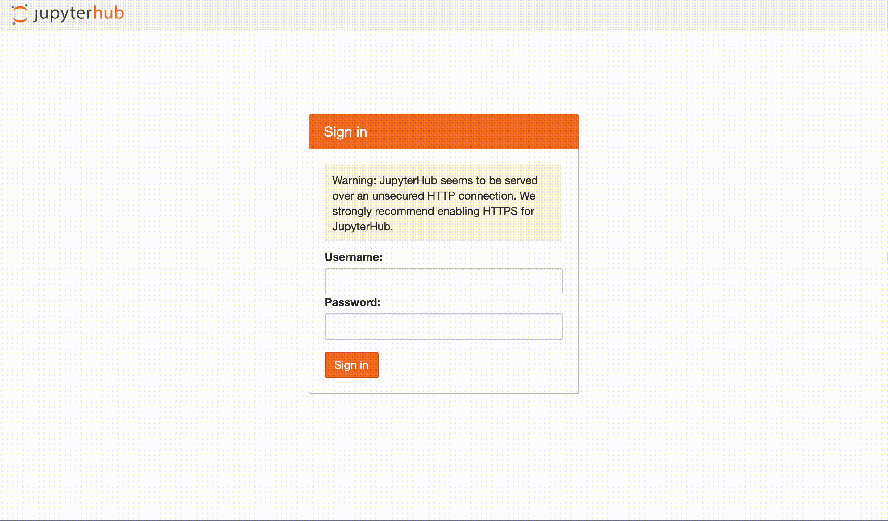
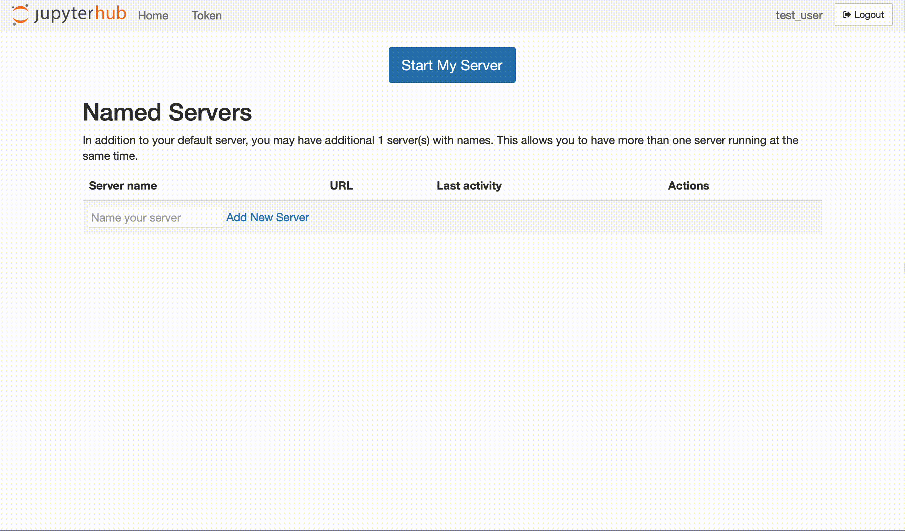

# user-manual

## 1&nbsp; Jupyter Hub

### 1.1&nbsp; Login

If you have been invited to use our compute servers, you have also been provided with `<user-name>` and `<ip-address>`. 

*1. Enter `http://<ip-adress>` in your browser to access the JupyterHub login page. Note that this page can only be accessed from within the university network or via virtual private network (VPN).*

*2. Enter your `<user-name>`.*

*3. Enter your password*

### 1.2&nbsp; Starting a Jupyter Server

... also named servers

### 1.3&nbsp; Selecting an Environment

## 2&nbsp; Jupyter Server

In this chapter, we will describe all of the building blocks that make up your Jupyter Server environment. 

### 2.1&nbsp; User Interface Options

You are provided with two user interface options, Jupyter Lab and Jupyter Notebook. 

#### 2.1.1&nbsp; Jupyter Lab (default)

The default user interface for the jupyter server is the [Jupyter Lab](https://jupyterlab.readthedocs.io/en/latest/), the url being `http://<ip-adress>/user/<user-name>/lab`. 

The Jupyter Lab user interface gives you all functionality that you could possible need in one single browser tab. On the left-hand side, you can find `file browser`, `running kernels`, `table of contents` (for an opened notebook), and the `extension manager`. On the right-hand side, you can find `property inspector` and the `debugging tool`. We may use the `kernel` tab to interrupt (`interrupt kernel`), shut down (`shut down kernel`), or restart (`restart kernel`) the selected kernel, meaning the kernel that is underlying the notebook or console that you are currently interacting with. We may use the `file` tab to log out (`log out`), or to go back to the Jupyter Hub (`hub control panel`) from where we can start and stop all of our Jupyter Server instances. 

The Jupyter Lab user inteface allows for different ways of running your code. Both `notebook` and `console` can be used for interactive programming, use the `notebook` runtime if you want to extend your code with markdown (see chapter 3.1.1). The `terminal` is less convenient, but it plays an important role when facing long-running jobs (see chapter 3.1.2). 

The Jupyter Lab user interface allows you to open and display a variety of text file formats (.py, .txt, .csv, .json, ...). This can be especially useful if you are trying to display a large .csv file that you would otherwise never be able to fit into memory. 

#### 2.1.2&nbsp; Jupyter Notebook

The alternative user interface for the jupyter server is the [Jupyter Notebook](https://jupyter-notebook.readthedocs.io/en/latest/), the url being `http://<ip-adress>/user/<user-name>/tree`. You can simply switch user interface by changing `/lab` to `/tree`. Note, however, that this switch will not persist when reloading the page, and that we strongly advise you to use Jupyter Lab.  

The Jupyter Notebook user interface is much more light-weight. The `Files` tab allows you to browse, upload, create, and delete files (including notebooks). The `Running` tab allows you to monitor and shutdown running notebooks and terminals. 

### 2.2&nbsp; Kernel options

You are provided with one or more kernel options, the default being Python. Please understand that, in terms of maintenance, we will not guarantee other options besides Python. 

#### 2.2.1&nbsp; Python

#### 2.2.2&nbsp; Other

With some image options (`data-science`, ...), you will also have access to other types of kernels such as [R](...) or [Julia](...). 

### 2.3&nbsp; Resource options

#### 2.3.1&nbsp; CPU
#### 2.3.2&nbsp; Memory
#### 2.3.3&nbsp; GPU
#### 2.3.4&nbsp; Storage

### 2.3&nbsp; Storage options

#### 2.3.1&nbsp; User storage
#### 4.2.1&nbsp; `read_only`
#### 4.2.2&nbsp; `temp`

## 3&nbsp; Workflow

Here, we describe steps for Python. 

> Note that any changes made to the environment will not persist after a restart, given that it is rebuilt every time from a docker image. The data in your user storage, however, *will* persist. 

### 3.1&nbsp; Runtime options

#### 3.1.1&nbsp; Prototyping via notebook or console

#### 3.1.2&nbsp; Long-running jobs via terminal

... prevent culling
... describe behavior before shutdown
... always write to file

### 3.2&nbsp; Organization options

#### 3.2.1&nbsp; Scripting

#### 3.2.2&nbsp; Modules

### 3.3&nbsp; Important steps

#### 3.3.1&nbsp; **Request resources** <--- lieber separaten Punkt draus machen

#### 3.3.2&nbsp; Import modules

#### 3.3.3&nbsp; Load input data
... see also 4.1 I/O

#### 3.3.4&nbsp; Perform computations
... refer to 4.2 Compute

#### 3.3.5&nbsp; Monitor computations

#### 3.3.6&nbsp; Save output data
... results

## 4&nbsp; Optimized Python

### 4.1&nbsp; I/O

use datatable settings to prevent using all threads!

#### 4.1.1&nbsp; Reading data

... datatable
`dt.fread().to_pandas()`
dt.iread()

#### 4.1.2&nbsp; Writing
`dt.Frame(df).to_csv(path, compression="gzip")`

### 4.2&nbsp; Compute

#### 4.1.1&nbsp; Naïve approach via multiple kernels

#### 4.1.2&nbsp; Multi-threading and multi-processing

#### 4.1.3&nbsp; GPU-enabled Python

### 4.3&nbsp; Memory

#### 4.3.1&nbsp; Generator for larger-than-memory data

## 5&nbsp; Where to go from here?

